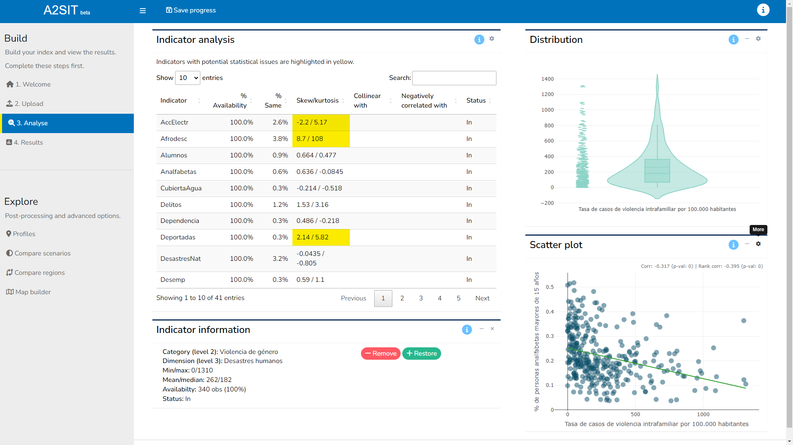

I've just come to the end of a very interesting contract working for the [UNHCR](https://www.unhcr.org/) in Guatemala (for the moment).

As you might know, the UNHCR helps displaced people around the world and protects human rights. In many places in the world there are movements of forcibly diplaced people, including refugees. Guatemala is one place where people are usually moving from South to North seeking refuge, asylum or simply a better life.

One issue faced by UNHCR staff is understanding where in the country to direct their limited resources to help people. There are many factors that can be used to decide where to intervene, and the picture can rapidly become complex.

To help this situation, I was contracted by UNHCR to build an app which can be used to construct composite indicators of "severity" at the municipal level (called "Admin-2" level by the UNHCR classification) in Guatemala.

The app, which is called the [Admin-2 Severity Index Tool (A2SIT)](https://rstudio.unhcr.org/SeverityIndex/) is a fairly complex Shiny app which runs on an R server. It is encapsulated in an R package that I also built called A2SIT [which is available on GitHub](https://github.com/UNHCR-Guatemala/A2SIT). I should mention that although I built the app and package, a huge amount of work was done in collecting the data, helping guide the app and designing the index, as well as many other things during the project.

In the app you can:

-   Upload your own data set which should be at the Admin 2 level for one of the supported countries
-   Obtain a statistical analysis of your data and flagged issues for indicators
-   Calculate index results and plot them on a map, and as tables and bar charts
-   Play with composite indicator settings
-   View and compare profiles of municipalities
-   Compare scenarios

There is also fairly comprehensive documentation which is available in an [online book](https://unhcr-guatemala.github.io/A2SIT/book/index.html)!

This has been a big project and I have learned a lot. But it has also been very rewarding. The app has been successful in testing with users, and should be rolled out to other countries in Central and South America. There is also a [Medium article](https://medium.com/unhcr-innovation-service/everything-all-at-the-same-time-6f554c74f586) on the app.

