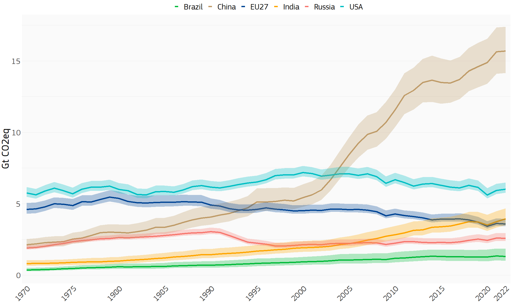

---
authors:
- admin
categories: []
date: "2023-12-21"
draft: true
featured: false
image:
  caption: ''
  focal_point: ""
  preview_only: false
projects: []
summary: "Looking back on a very busy and interesting year."
tags:
- Meta
title: "2023 Wrap Up"
---

So it's the end of 2023, I've closed all the big projects that needed closing before Christmas, and thought that a little summary of the year was in order.

2023 was a very busy but also very interesting year for me. As usual in freelance mode, things go up and down quite a lot: the start of the year was fairly manageable, June and July were crazy-busy, the summer was a nice break but I paid for that dearly in September until the end of November period in which a lot of big projects needed finishing at the same time and I nearly melted! Now at the end of December I'm feeling pretty relaxed and everything is fine. Which is why I finally have some time to write something here.

So, looking back on the year, here is how it went.

Things kicked off in early January when I started working half-time as a data scientist at the European Commission's Joint Research Centre (JRC), in the EDGAR group which produces and manages a global database on greenhouse gas emissions. Although I'd worked in the JRC for quite a few years, this was a completely new topic and it took me a while to find my feet and learn all about different GHG emissions, how they are estimated, and the technical ins and outs of the database. After this burn-in period however, and some sharpening my SQL skills, I managed to produce a custom R package and app which allows uncertainty estimation of GHG emissions across any sector, country, substance and time point. Here's a little snapshot of the uncertainty estimations:

It looks quite straightforward but a lot of work went into it!

Anyway my JRC EDGAR work has been the stable half of my work for the whole of 2023 and I'm glad to say I will be continuing with the group well into 2024.

Another big project that has run through 2023 is building the A2SIT app for UNHCR Guatemala. This started in January when I was contracted to begin work building the back-end code to build a composite indicator to understand which municipalities were most in need of community-based protection in Guatemala. The UNHCR team were in the process of collecting indicators and data, and I helped them build the composite indicator and the data pipeline to calculate index scores, using as usual the COINr package. At the end of the initial contract, I also floated the idea that I could build the front end of the app using Shiny, and this led to more work with them, and now I'm very proud to say the A2SIT app is deployed and has been presented to UNHCR offices in various countries as a general tool for measuring "severity". I'm just wrapping up what will probably be my last contributions to the project as it is pretty much finished, but to give some highlights:

- The app is built in Shiny using Shinydashboardplus
- It takes a custom set of indicators and data uploaded in an Excel file
- 
